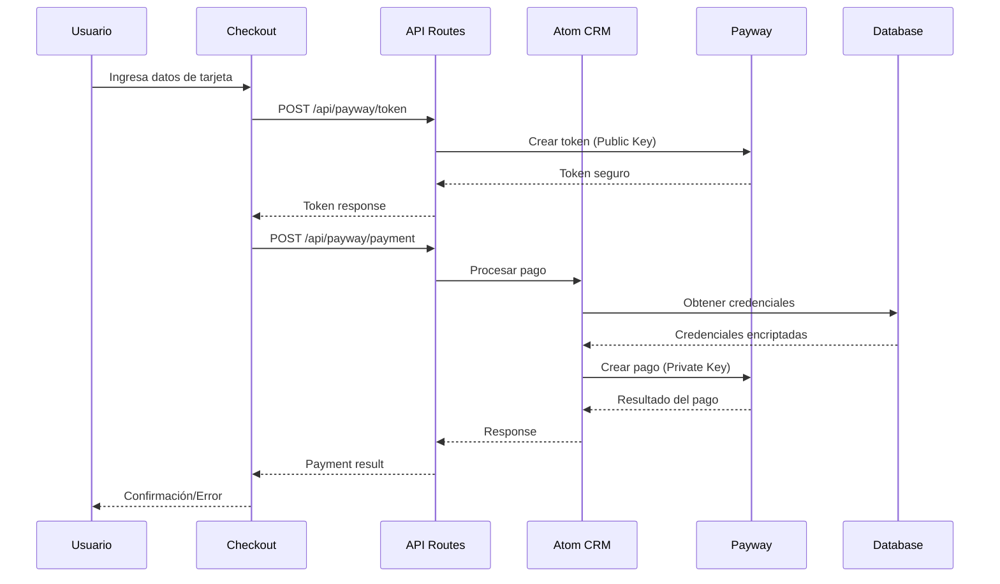
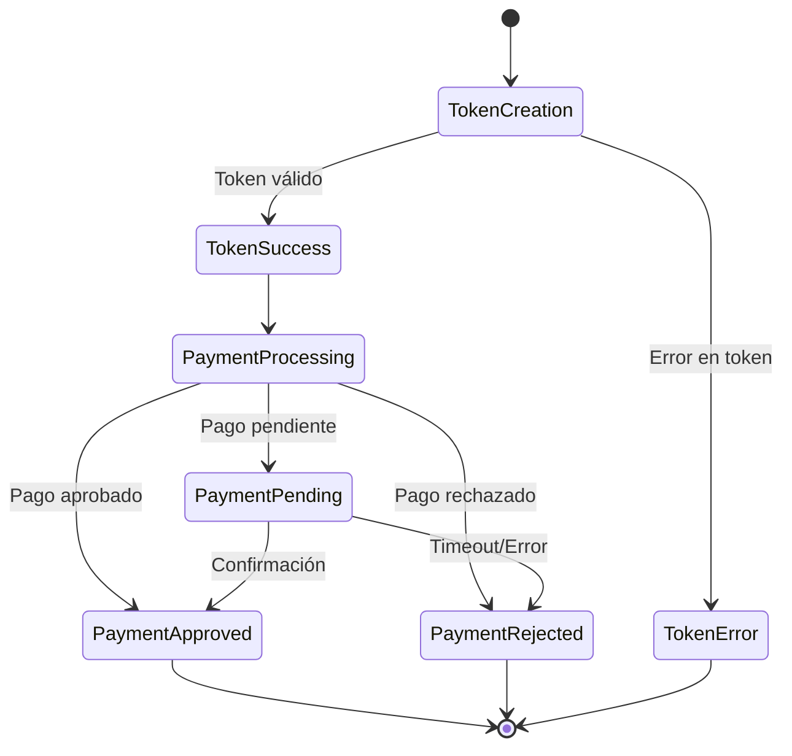
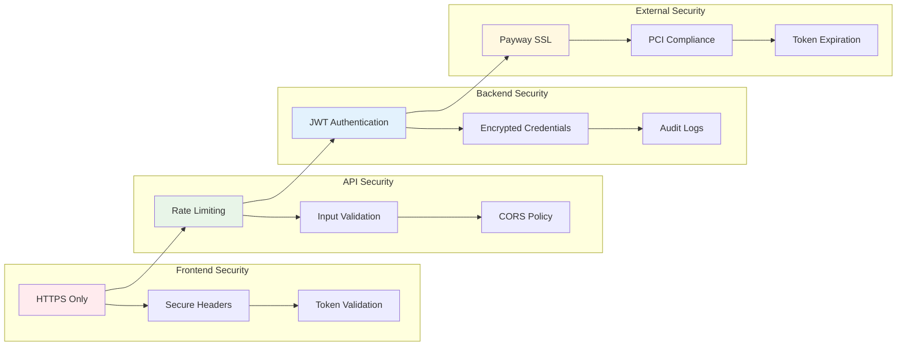
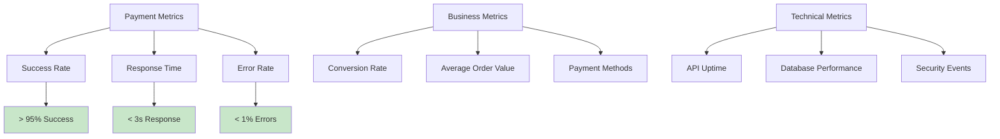

# Diagrama Completo - Integración Payway

## 🏗️ Arquitectura de Integración

```mermaid
graph TB
    subgraph "Frontend - Dibuy"
        A[Checkout Page] --> B[Payment Service]
        B --> C[Token Creation]
        B --> D[Payment Processing]
    end
    
    subgraph "API Routes - Next.js"
        E[/api/payway/token] --> F[Token Endpoint]
        G[/api/payway/payment] --> H[Payment Endpoint]
    end
    
    subgraph "Backend - Atom CRM"
        I[Payway Controller] --> J[Payway Service]
        J --> K[Payment Integration Service]
        K --> L[Encrypted Credentials]
    end
    
    subgraph "External Services"
        M[Payway API - Tokens]
        N[Payway API - Payments]
        O[Database]
    end
    
    A --> E
    A --> G
    F --> M
    H --> I
    J --> N
    K --> O
    
    style A fill:#e1f5fe
    style F fill:#f3e5f5
    style H fill:#f3e5f5
    style J fill:#e8f5e8
    style M fill:#fff3e0
    style N fill:#fff3e0
```

## 🔄 Flujo de Proceso de Pago



## 📊 Estados del Pago



## 🔐 Arquitectura de Seguridad



## 🚀 Configuración de Entornos

### Desarrollo
```yaml
Environment: development
Payway URL: https://developers.decidir.com/api/v2
Database: Local MySQL
SSL: Self-signed
Logging: Debug level
```

### Staging
```yaml
Environment: staging
Payway URL: https://developers.decidir.com/api/v2
Database: Staging MySQL
SSL: Valid certificate
Logging: Info level
```

### Producción
```yaml
Environment: production
Payway URL: https://live.decidir.com/api/v2
Database: Production MySQL (encrypted)
SSL: Valid certificate + HSTS
Logging: Error level only
Monitoring: Full metrics
Backups: Daily automated
```

## 📈 Métricas y Monitoreo



## 🔧 Componentes Principales

### 1. Frontend (Dibuy)
- **Checkout Page**: Interfaz de usuario para el proceso de pago
- **Payment Service**: Lógica de negocio para pagos
- **Form Validation**: Validación de datos de tarjeta
- **Error Handling**: Manejo de errores y feedback al usuario

### 2. API Routes (Next.js)
- **Token Endpoint**: Creación segura de tokens
- **Payment Endpoint**: Procesamiento de pagos
- **Status Endpoint**: Consulta de estado de pagos
- **Security Middleware**: Validación y rate limiting

### 3. Backend (Atom CRM)
- **Payway Controller**: Endpoints REST para pagos
- **Payway Service**: Lógica de integración con Payway
- **Credential Management**: Manejo seguro de credenciales
- **Audit System**: Registro de transacciones

### 4. Base de Datos
- **Sales Table**: Registro de ventas
- **Payment Logs**: Historial de transacciones
- **Encrypted Credentials**: Credenciales de Payway por empresa
- **Audit Trail**: Registro de eventos de seguridad

## 🎯 Puntos Críticos de Implementación

### 1. Seguridad
- ✅ Nunca exponer claves privadas en frontend
- ✅ Usar HTTPS en todos los endpoints
- ✅ Validar todos los inputs
- ✅ Implementar rate limiting
- ✅ Encriptar credenciales en base de datos

### 2. Performance
- ✅ Timeout de 30s para pagos
- ✅ Retry logic para fallos temporales
- ✅ Caching de credenciales
- ✅ Optimización de queries de DB
- ✅ Compresión de responses

### 3. Reliability
- ✅ Health checks en todos los servicios
- ✅ Circuit breaker para Payway API
- ✅ Graceful degradation
- ✅ Comprehensive logging
- ✅ Automated monitoring

### 4. Compliance
- ✅ PCI DSS compliance
- ✅ Data retention policies
- ✅ Privacy by design
- ✅ Audit trail completo
- ✅ Incident response plan

## 📋 Checklist de Implementación

- [x] Crear endpoints de API seguros
- [x] Actualizar servicio de pagos
- [x] Configurar variables de entorno
- [x] Implementar manejo de errores
- [ ] Configurar monitoreo
- [ ] Implementar tests automatizados
- [ ] Configurar CI/CD pipeline
- [ ] Documentar APIs
- [ ] Realizar pruebas de carga
- [ ] Configurar alertas de producción